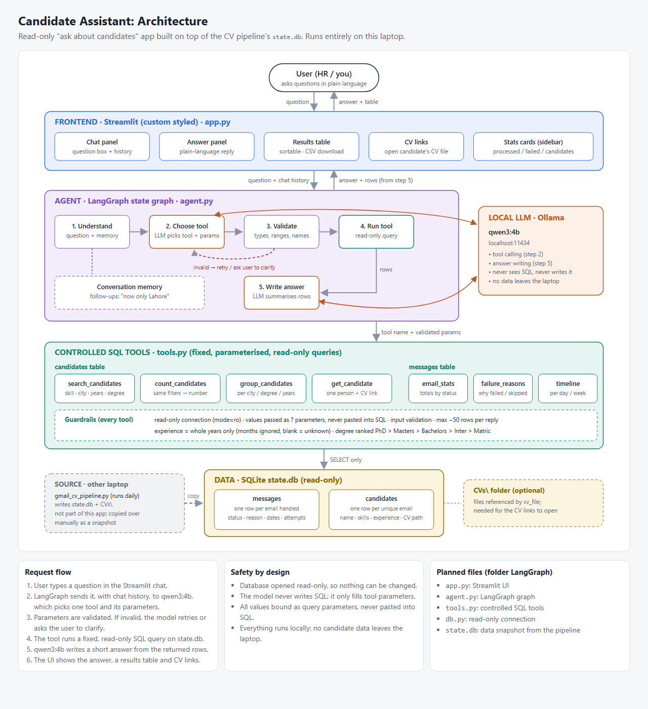

# LangGraph Project

[One or two sentences: what this project does, e.g. "An AI agent built with LangGraph that ..."]

## Architecture




An interactive version is available in `architecture.html`.

## Project Structure

| File | Description |
|------|-------------|
| `agent.py` | Defines the LangGraph agent, its nodes, and the graph flow |
| `app.py` | Main entry point / user interface for running the app |
| `tools.py` | Tools the agent can call |
| `db.py` | Database setup and helpers (state is stored in a local SQLite DB) |
| `architecture.html` / `architecture.png` | Architecture diagram |
| `Flow of LangGraph.png` | Diagram of the graph flow |

## Getting Started

### Prerequisites
- Python 3.10+
- An API key for [your LLM provider, e.g. OpenAI]

### Installation
```bash
git clone https://github.com/23586/LangGraph-Project.git
cd LangGraph-Project
pip install langgraph [other packages you use]
```

### Configuration
Create a `.env` file in the project root:
